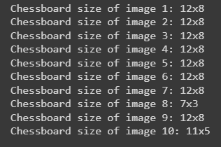

# DetermineChessBoardSize
- Dataset: A set of 10 chessboard images which are taken with different angle, noise and light

- After data preprocess: Remove noise, enhance contrast and brightness

- After threshold and remove background:

- Corner Detection

- Result

